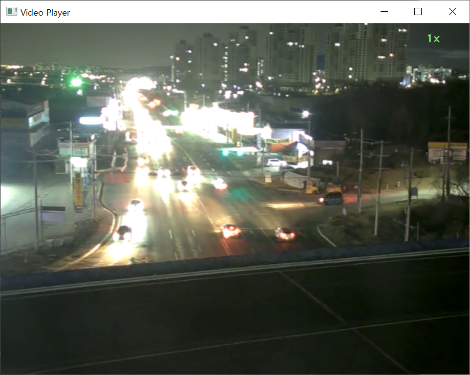
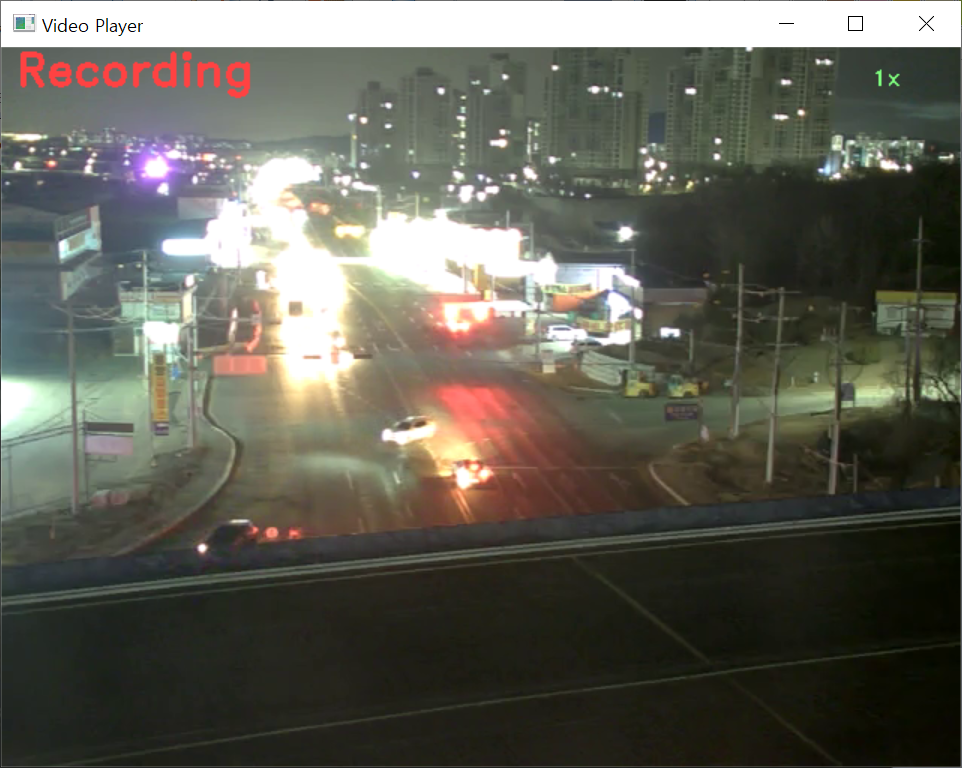

Python의 cv2에서 RTSP 주소를 활용하여 영상을 불러오고 기록하는 프로그램  
get video using RTSP address and record video  

기능: 영상 기록, 영상 속도 조절

영상을 기록: space키를 누르고 영상 기록을 시작하고 다시 한 번 space키를 눌러 영상 기록을 종료  
영상의 제목: 영상을 찍기 시작한 시간.avi   
(예시: 20010101_000000.avi)  

영상 속도 조절: 속도를 낮추려면 ',' 또는 '<', 속도를 높이려면 '.' 또는 '>'  
속도는 좌측 상단에 표기  

영상을 기록하기 전  
  

영상을 기록하는 중  
  

